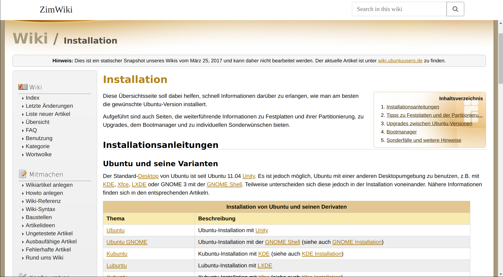

# ZimServer
A modern zim fileserver which can handle multiple zim files by serving a beautiful Wiki website. It is a lightweight and performant relpacement for kiwix-serve and can handle many big wiki archives (zim files).

# Screenshots
<table>
<thead>
    <td>
        Desktop
    </td>
    <td>
        Mobile
    </td>
</thead>
<tr>
    <td>
        
    </td>
    <td>
        
    </td>
</tr>
<tr>
    <td>
        
    </td>
    <td>
        
    </td>
</tr>
</table>
 
 

# Installation
- Install go and compile it using `go build -o zimserver`
or
- Download the latest release

# Usage
Create a folder `library` and place your .zim files inside it, or link them using symlinks. 
Run the binary and go to `https://localhost:8080`

# Features
- [x] Read/Handle multiple Zim files
- [x] Read Wikis
- [x] Search
- [ ] Replace absolute links with relative ones