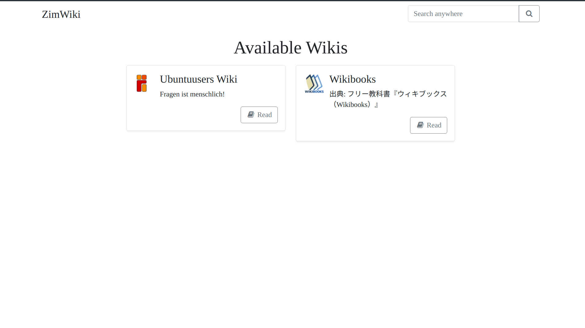

# ZimWiki
A modern zim fileserver which can handle multiple zim files by serving a beautiful Wiki website. It is a lightweight and performant replacement for kiwix-serve and can handle many big wiki archives (zim files).

# Screenshots
<table>
<thead>
    <td>
        Desktop
    </td>
    <td>
        Mobile
    </td>
</thead>
<tr>
    <td>
        
    </td>
    <td>
        
    </td>
</tr>
<tr>
    <td>
        
    </td>
    <td>
        
    </td>
</tr>
</table>
<br>
 

# Installation
- Install go and compile it using `go build`
or
- Download the latest release

# Configuration
### Example
config.toml:
```toml
[Config]
LibraryPath = "./library"
Address = ":8080"
```

# Usage
Your `LibraryPath` must contain your .zim files inside it, you can also link them using symlinks.  
Run the binary and go to `https://localhost:Port`

# Features
- [x] Read/Handle multiple Zim files
- [x] Read Wikis
- [x] Search (inside a wiki or globally)
- [x] Create wiki index files for faster search
- [x] Send content gzipped
- [x] Use symlinks as .zim link
- [x] Replace absolute links with relative ones
- [X] Config file
